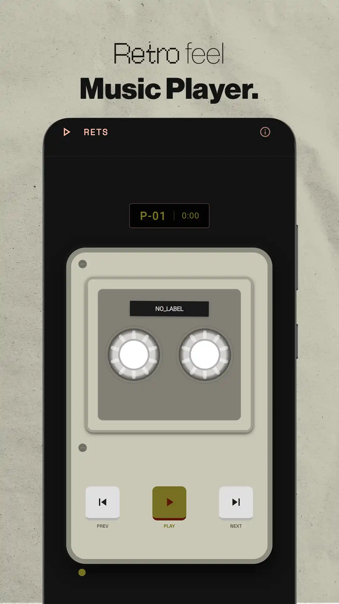
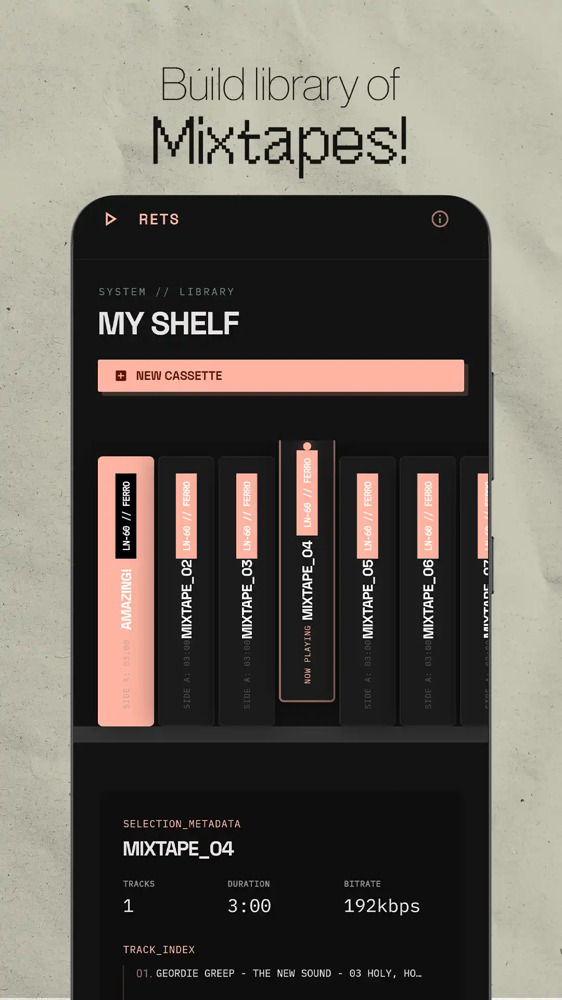
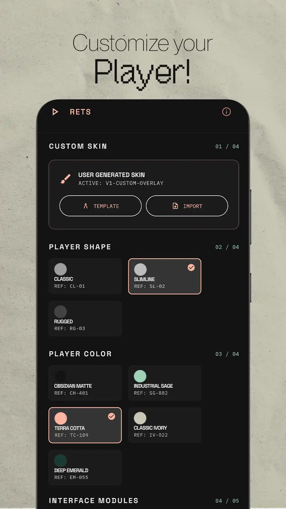
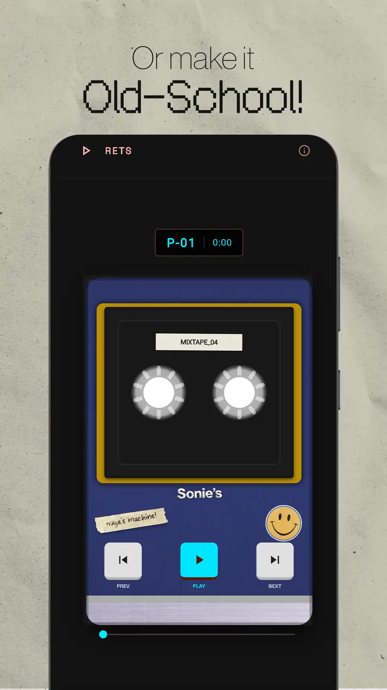

# 📼 Rets — Retro Music Player

**Rets** is a retro-inspired music player designed as a **digital cassette deck**.  
Instead of generic playlists, your music is organized into **cassettes** with customizable **hardware** and **skins**.

A tactile listening experience inspired by physical media.

---

## 📷 Screenshots

<table align="center">
<tr>
<td align="center">

### Deck

</td>

<td align="center">

### Library

</td>

<td align="center">

### Hardware

</td>

<td align="center">

### Skin Editor

</td>

</tr>
</table>

---

## ✨ Features

### 📼 Digital Cassette Deck
- Cassette tape animation during playback
- Immersive skeuomorphic interface
- Background playback support
- Built with `just_audio` + `audio_service`

### 🎨 Hardware Customization
Design your own cassette player:
- colors
- materials
- accents
- adaptive UI theme

### 🏷 Cassette Skin Generator
Create custom cassette designs:
- customizable templates
- exportable skins
- printable layouts

### 📚 Cassette-based Library
Organize music as collections:
- Cassettes
- Tracks
- Metadata via `audiotags`
- Local storage with `Hive`

### ⚡ Adaptive UI
Interface dynamically adapts to:
- hardware color themes
- cassette skins
- visual accents

---

## 🧱 Tech Stack

- Flutter
- just_audio
- audio_service
- Hive
- audiotags

---

## 🚀 Installation

### Download APK

  

Download the latest APK from the Releases page and install it on your Android device.

---

## 📜 License

MIT License
